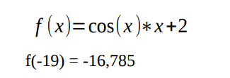

# Inteligencia Artificial

### Membros
Ana Carolina Cebin Pereira - 20152bsi0188<br>
Matheus Kleber Rodrigues Barbosa - 20152bsi0218

## Relatório - Algoritmo genético

### Explicação teórica do algoritmo
Os algoritmo genético simulam a evolução de uma população. Essa população pode ser uma representação abstrata, onde o objetivo é evoluir essa população a cada geração através de <i>crossover</i> ou mutações.

Toda geração passa por algumas fases, sendo elas:

1. População inicial da geração
2. Selecioar os indivíduos que estão mais aptos
3. Cruzar os indivíduos
4. Mutação dos indivíduos

### Problema
O problema que este código visa resolver é a minimização da seguinte função:



Onde que, um bom resultado é próximo de -16.7.


## Solução

A solução deste trabalho consiste na implementação do algoritmo genético em forma de <i>pipe</i>, onde que o resultado de cada fase seja a entrada da próxima, incluindo o resultado da última fase que é a entrada da primera fase.

### Organização do código
Este código está separado em quatro arquivos: **Configs.py**, **Subject.py**, **main.py** e **tools.py**.

**Configs.py** é o arquivo que contém a classe `Config` com todos os parâmetros da solução.

**Subject.py** é o arquivo que contém a class `Subject`, que é responsável por armazenar os atributos e comportamento de cada indivíduo da população. 

Um indivíduo possui três principais valores, `binary_gene` que é um vetor de binários de 16 casas, `gene_value` é a representação decimal de `binary_gene` e `fitness_value` que representa a aptidão do indivíduo.

**main.py** é o arquivo que centraliza a lógica do código. Esse arquivo inicia a simulação.

**tools.py** é o arquivo que contém funções auxiliares que não fazem parte do *core* da solução.

### Implementação
Nesse relatório só será apresentado os principais detalhes da solução. Para visualizar a solução completa basta acessar os arquivos do código fonte.

O código se inicial com a instanciação das configurações e a chamada do método principal `main()`.

```python
def main():
    gen = 1
    elit_population = None
    
    for i in range(configs.generations_interacions):
        base_population = phase_base_population(elit_population)
        selected_population = phase_tournament(base_population)
        crossovered_population = phase_crossover(selected_population)
        mutated_population = phase_mutation(crossovered_population)
        elit_population = phase_elitism(mutated_population, base_population)
        print_best_subject(elit_population, gen)
        gen += 1
```

A `main()` faz a iteração entre as gerações, onde que cada fase é armazenada uma variavel que é passada em diantes e a última população, `elit_population` é usada para ser a população inicial de cada geração.

A partir desse ponto, o código de cada fase será apresentado, iniciando pela `phase_base_population`.

#### Fase 1 - População base
```python
def phase_base_population(prev_population):
    if prev_population == None:
        population = [Subject(configs) for _ in range(configs.population_size)]
    else:
        population = prev_population

    return population
```

Na primera fase é verificado se a população anterior é `None` em caso de ser a primeira iteração. Se for, uma nova população é instânciada, se não é usada a anterior, que já foi instânciada.

No construtor da class `Subject` é realizado uma chamada de um método chamado `__init_values()`, que faz com que os valores de cada indivído já seja criado conforme definido no problema.

Sendo iniciados da seguinte forma:

```python
def __normalize_gene_value(self, value):
    min = self.configs.normalized_interval[0]
    max = self.configs.normalized_interval[1]
    
    x = min + (((max - min) * value) / (2**self.configs.binary_gene_size - 1))
    return x

def __generate_binary_gene(self):
    binary_gene = [randint(0, 1) for _ in range(self.configs.binary_gene_size)]
    return binary_gene

def __generate_gene_value(self):
    decimal_value = binary_array_to_decimal(self.binary_gene)
    normalized_value = self.__normalize_gene_value(decimal_value)
    return normalized_value

def __fitness_function(self):
    fitness_value = cos(self.gene_value) * self.gene_value + 2
    return fitness_value

def __init_values(self):
    self.binary_gene = self.__generate_binary_gene()
    self.gene_value = self.__generate_gene_value()
    self.fitness_value = self.__fitness_function()
```
#### Fase 2 - Torneio
Com a população inicial definida, é preciso selecionar os melhores indivíduos dessa população. Essa seleção é realizada por torneio e seu método é:

```python
def phase_tournament(population):
    size = configs.population_size
    result_population = population

    for i in range(size):
        r1 = randint(0, size-1)
        r2 = randint(0, size-1)
        
        if(population[r1].fitness_value > population[r2].fitness_value):
            result_population[i] = population[r2]
        else:
            result_population[i] = population[r1]
    
    return result_population
```

Basicamente os indivíduos competem pela permanencia na população, quem tiver o melhor valor de aptidão (`fitness_value`) ganha.

#### Fase 3 - Cruzamento
Depois de selecionar os melhores da população é necessário realizar o cruzamento dos indivíduos.

```python
def phase_crossover(population):
    size = configs.population_size
    result_population = population

    for i in range(0, size, 2):
        r1 = randint(0, size-1)
        r2 = randint(0, size-1)

        can_crossover = randint(1, 100) <= configs.crossover_rate
        if(can_crossover):
            index_to_crop = randint(1, (configs.binary_gene_size - 1))

            actual = population[r1]
            next = population[r2]
            
            result_population[i] = actual.crossover(index_to_crop, next.binary_gene)
            result_population[i+1] = next.crossover(index_to_crop, actual.binary_gene)
    
    return result_population
```

Repare que em cada indivíduo possui o método de `crossover`, sendo ele:

`Subject`
```python
def crossover(self, index, parent):
    child = Subject(self.configs)
    child.binary_gene[:index] = self.binary_gene.copy()
    child.binary_gene[index:] = parent[index:].copy()
    
    child.gene_value = self.__generate_gene_value()
    child.fitness_value = self.__fitness_function()

    return child
```

Repare que ao realizar o *crossover* é gerado um novo indivíduo que possui a mistura do `binary_gene` dos indivíduos relacionados. Além disso, os valores de `gene_value` e `fitness_value` também são re-calculados após a inserção do novo `binary_gene`.

#### Fase 4 - Mutação
Depois do cruzamento é feita uma tentativa de fazer mutação em cada indivíduo da população. Cada indivíduo possui seu método de fazer mutação.

```python
def phase_mutation(population):
    size = configs.population_size
    result_population = population

    for subject in result_population:
        subject.mutate()
    
    return result_population
```

`Subject`
```python
def mutate(self):
    for i in range(len(self.binary_gene)):
        can_mutate = randint(1, 100) <= self.configs.mutate_rate
        if(can_mutate):
            if self.binary_gene[i] == 0:
                self.binary_gene[i] = 1
            else:
                self.binary_gene[i] = 0
            
            self.gene_value = self.__generate_gene_value()
            self.fitness_value = self.__fitness_function()
```

Existe uma probabilidade de acontecer uma mutação em um dos bits de `binary_gene` de cada indivíduo. Caso isso aconteça, é necessário ajustar os valores de `gene_value` e `fitness_function`.

#### Fase 5 - Elitismo
Por fim, é realizado o elitismo. A entrada dessa fase é a população inicial. Essa fase visa pegar o melhor indivíduo da população incial e garantir a sobrevivência dele para a próxima geração.

```python
def phase_elitism(actual_population, base_population):
    min = inf
    max = -inf
    best_subject = None
    worst_subject = None
    index_to_change = 0

    for subject in base_population:
        if subject.fitness_value <= min:
            best_subject = subject
            min = subject.fitness_value
    
    for i in range(len(actual_population)):
        subject = actual_population[i]
        if subject.fitness_value >= max:
            worst_subject = subject
            max = subject.fitness_value
            index_to_change = i
    
    actual_population[index_to_change] = best_subject
    return actual_population
```

Como é possível ver no código, é realizada a troca do melhor indivíuo da população inicial pelo pior indivíduo da população gerada na fase anterior (mutação).

Depois dessa fase todo o processo é repetido e todas as fases são percorridas novamente até o limite definido em `generations_interacions` dentro da classe `Configs`.

Ao final de cada geração também é impresso o melhor indivíduo daquela geração.

## Resultados

Usando as configurações sugeridas, sendo elas:

* Tamanho da população = 10
* Chance de crossover = 60%
* Chance de mutação = 1%

Acontece resultados muito inconstantes, na maioria das vezes o algoritmo cai em mínimos locais. Os resultados podem ser de entre 8 até -16.87.

Mudando um poucos esses valores:

* Tamanho da população = 30
* Chance de crossover = 60%
* Chance de mutação = 3%

Já é possível obter melhores resutlados, que ficam entre -7 e -16.87.

Para atingir o valor ideal, que é -16.87 em quase todas as vezes foi necessário usar os valores:

* Tamanho da população = 100
* Chance de crossover = 75%
* Chance de mutação = 3%

Com esses valores ainda foi possível notar uma aptidão final de -13, mas é muito raro de acontecer. Os valore são majoritariamente de -16.87, que é o valor ideal.


